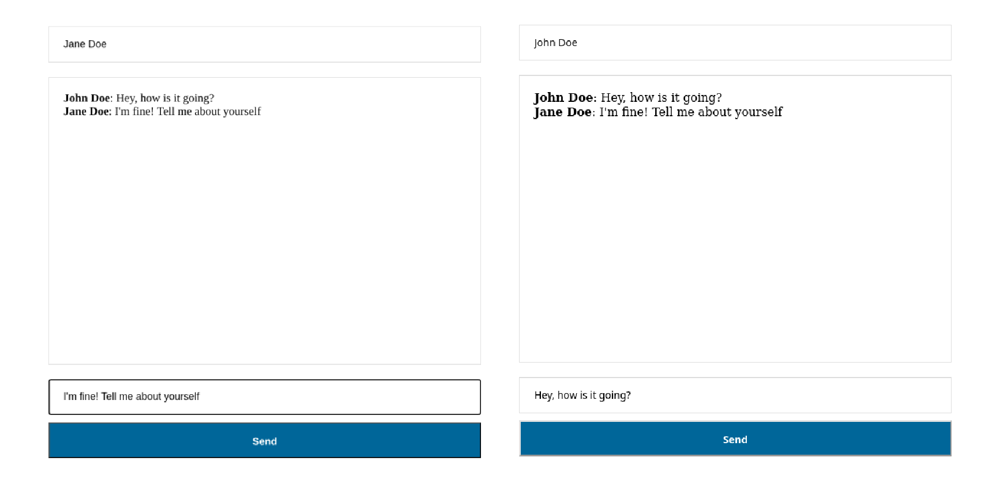

<h1 align="center"> Real-Time Chat </h1>

<p align="center">
  
  
  
  
  
  
  
</p>

<p align="center">
  <a href="#-technologies">Technologies</a>&nbsp;&nbsp;&nbsp;|&nbsp;&nbsp;&nbsp;
  <a href="#-project">Project</a>&nbsp;&nbsp;&nbsp;|&nbsp;&nbsp;&nbsp;
  <a href="#-layout">Layout</a>&nbsp;&nbsp;&nbsp;|&nbsp;&nbsp;&nbsp;
  <a href="#memo-licença">Licença</a>
</p>

<p align="center">
  
</p>

<br>

<p align="center">
  
</p>

## 🚀 Technologies

This project was developed with the following technologies:

- HTML e CSS
- JavaScript
- Node.js
- Express.js
- Socket.IO
- Embedded JavaScript templates (EJS)
- Yarn
- Git e Github

## 💻 Project

This repository hosts my real-time chat project, which I created to practice my skills in HTML, CSS, and JavaScript. The project features a simple and intuitive interface that allows users to send and receive messages in real time. Experience instant communication with this application, featuring live message updates and user presence.

## 💻 How to run

```bash
# Clone the repository
git clone https://github.com/filipebteixeira98/chat-realtime.git

# Access the project folder
cd chat-realtime

# Install the dependencies
yarn install
# or
yarn
# you can also use npm
npm install
# or
npm i

# Start the development server
yarn start
# or
npm start
```

## 📝 License

This project is under the MIT license.

<p align="center">
  Made with ♥ by me
</p>
